# Live Scoreboard API - Architecture Diagrams

## System Architecture Overview

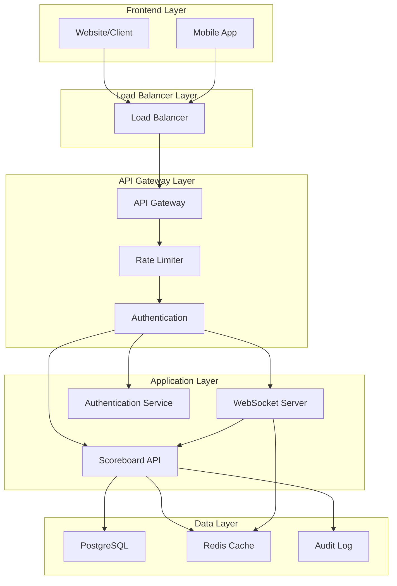

## Score Update Flow

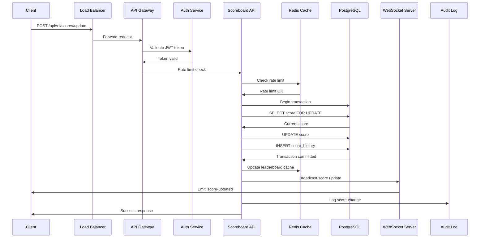

## Real-time Leaderboard Flow

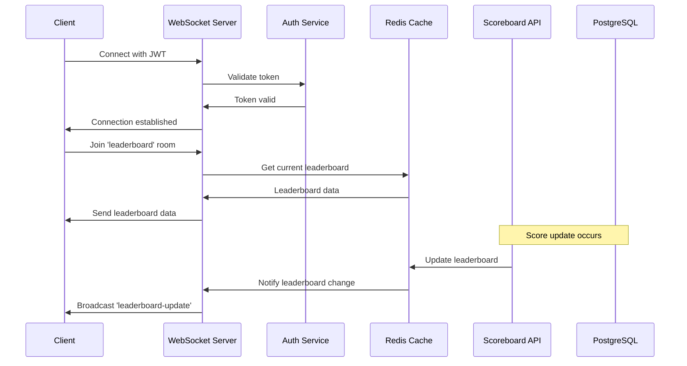

## Authentication Flow

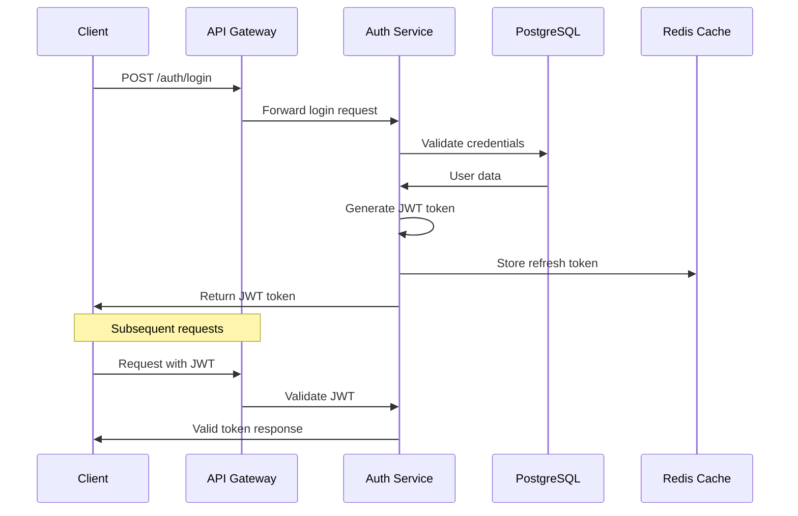

## Security Flow

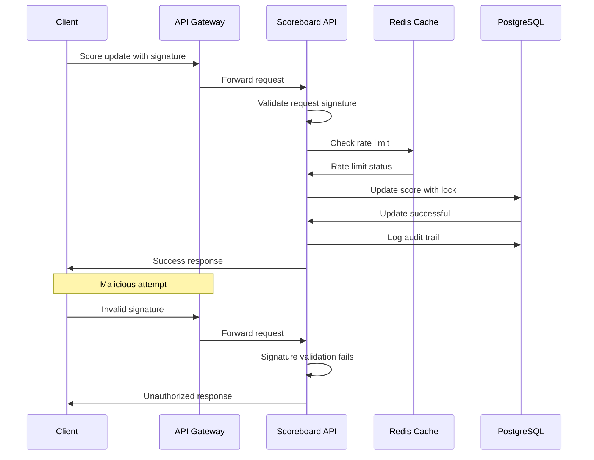

## Caching Strategy

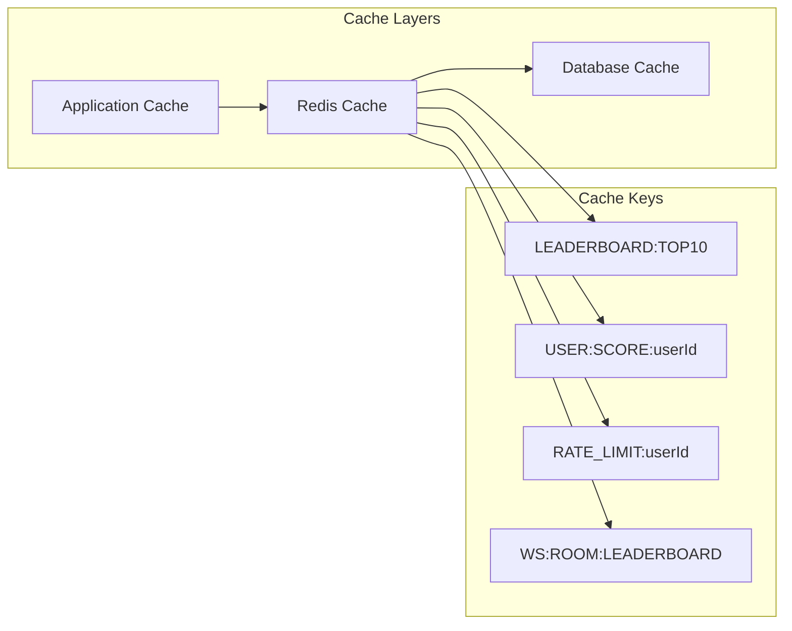

## Database Schema Relationships

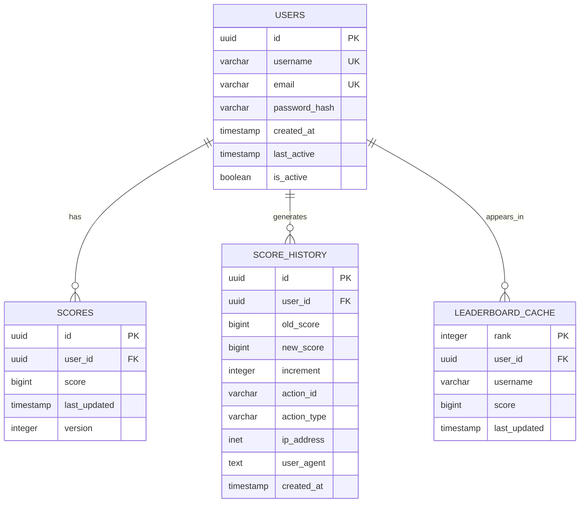

## Deployment Architecture

```mermaid
graph TB
    subgraph "Production Environment"
        subgraph "Load Balancer Tier"
            LB1[Load Balancer 1]
            LB2[Load Balancer 2]
        end
        
        subgraph "Application Tier"
            API1[API Instance 1]
            API2[API Instance 2]
            API3[API Instance 3]
            WS1[WebSocket Instance 1]
            WS2[WebSocket Instance 2]
        end
        
        subgraph "Data Tier"
            DB1[(PostgreSQL Primary)]
            DB2[(PostgreSQL Replica)]
            REDIS1[(Redis Master)]
            REDIS2[(Redis Replica)]
        end
        
        subgraph "Monitoring Tier"
            MON1[Prometheus]
            MON2[Grafana]
            MON3[ELK Stack]
        end

        subgraph "Monitoring Tier"
            MON1[Prometheus]
            MON2[Grafana]
            MON3[Logging monitor (ELK|PLG Stack)]
        end
    end
    
    LB1 --> API1
    LB1 --> API2
    LB1 --> API3
    LB2 --> WS1
    LB2 --> WS2
    
    API1 --> DB1
    API2 --> DB1
    API3 --> DB1
    WS1 --> REDIS1
    WS2 --> REDIS1
    
    DB1 --> DB2
    REDIS1 --> REDIS2
    
    API1 --> MON1
    API2 --> MON1
    API3 --> MON1
    API1 --> MON3
    API2 --> MON3
    API3 --> MON3
    MON1 --> MON2
```

## Error Handling Flow

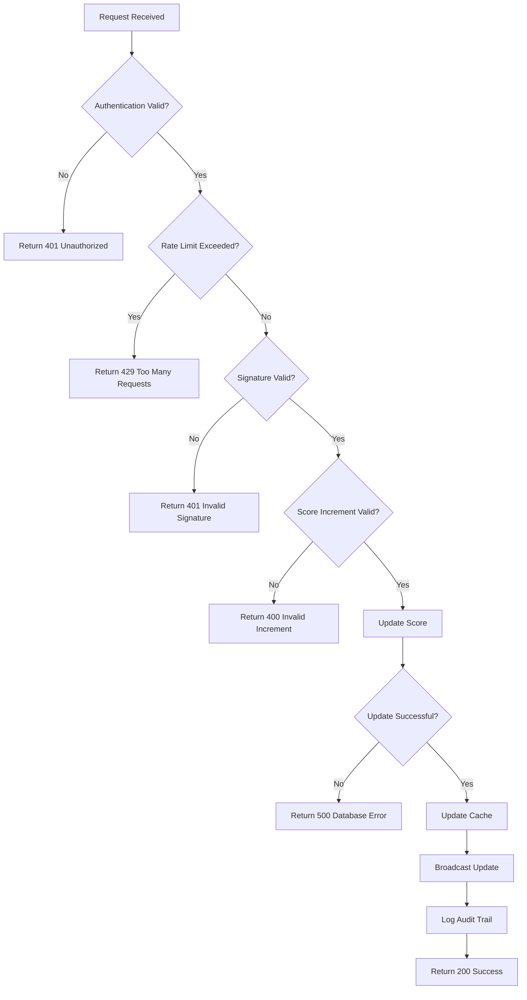

## Performance Monitoring Flow

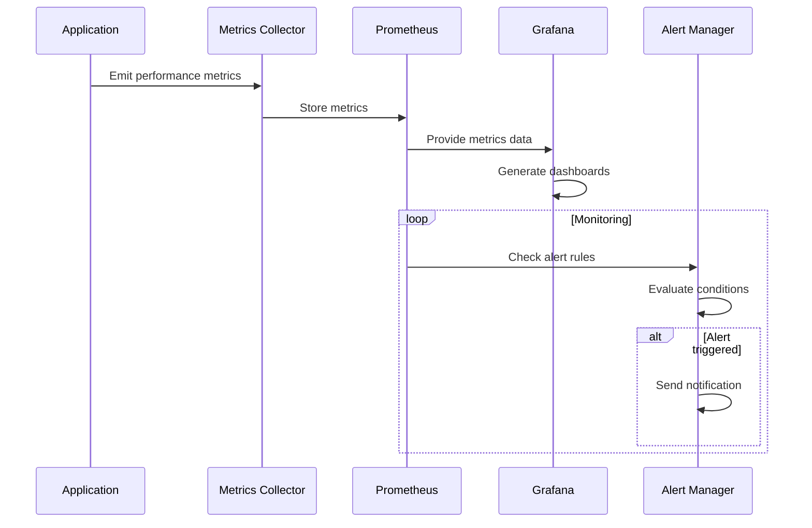

## Security Monitoring Flow

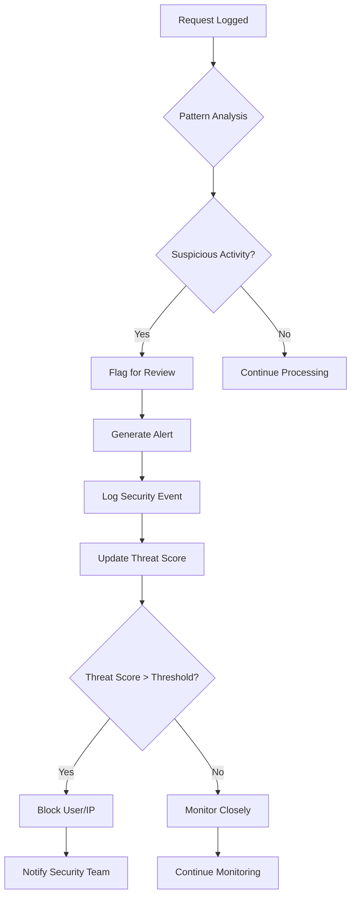

## Scalability Considerations

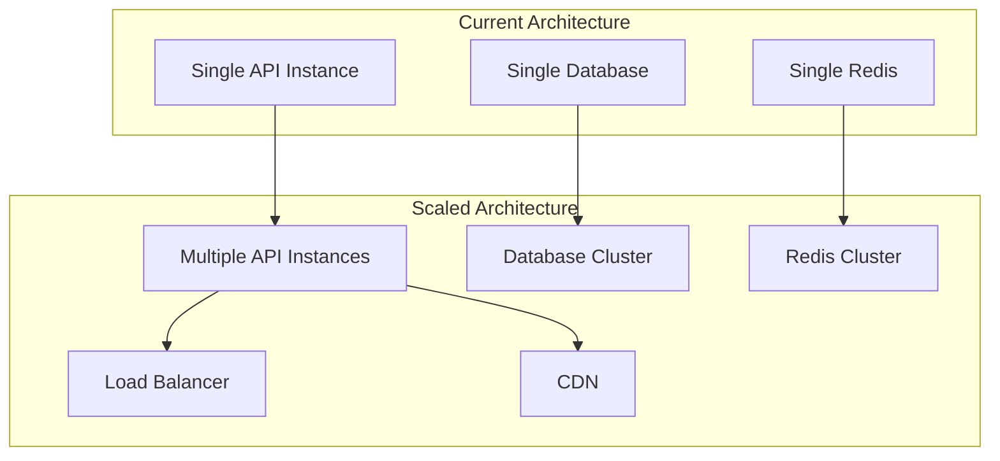

---

## Key Design Principles

1. **Separation of Concerns**: Each component has a single responsibility
2. **Fault Tolerance**: System continues to operate even if some components fail
3. **Scalability**: Architecture supports horizontal scaling
4. **Security**: Multiple layers of security validation
5. **Performance**: Caching and optimization at multiple levels
6. **Monitoring**: Comprehensive observability and alerting
7. **Audit Trail**: Complete logging of all score changes
8. **Real-time Updates**: WebSocket-based live updates 